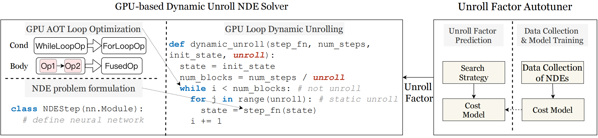

# Dynamic Unroll for Neural Differential Equation

Neural Differential Equation with Dynamic Unroll

## Installation

Install JAX, equinox, diffrax

Code was run using python 3.10.4

## Contents

* `cost-model`: Train cost model

* `high-dim-pde`, `latent-ode`, `neural-cde`, `neural-ode`:  Examples with diffrax or dynamic unroll methods

* `synthetic`: Create synthetic data

* `unroll_predict_examples`: Examples for predicting unroll with trained model

* `unroll_test`: Test the effect of `unroll` size on time consumption under different struture of Neural Networks

* `simluated_annealing.py`: Our implementation for simluated annealing

## Run Code

You can configure parameters in `*.py` or in `run.sh`, details are displayed in each `*.py` file.

* `high-dim-pde`: Go to dir `high-dim-pde` and execute `sh run.sh`

* `latent-ode`, `neural-cde`, `neural-ode`: In each dir, execute `bash run.sh`, since bash script is used. 

* `unroll_predict_examples`: Provide a examples of predicting `unroll` with trained model under a specific structure of Neural ODE

* `unroll_test`: You can change diffrent structure of NN in `run.sh` to see the effect of `unroll` size

